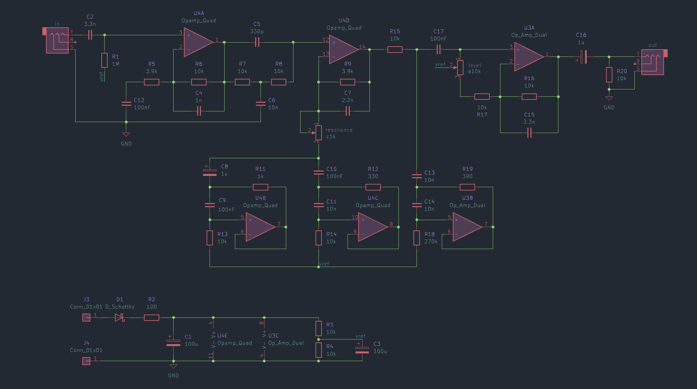
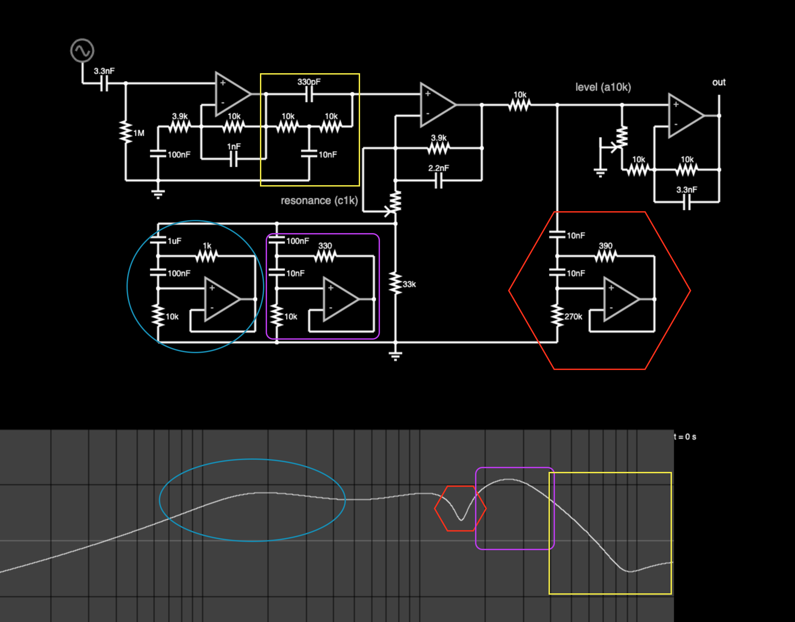
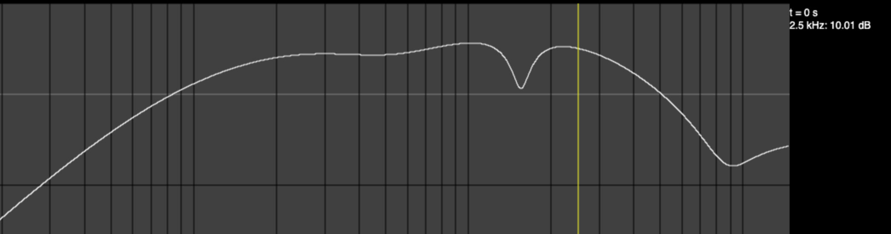
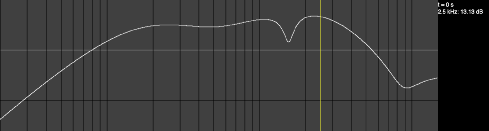
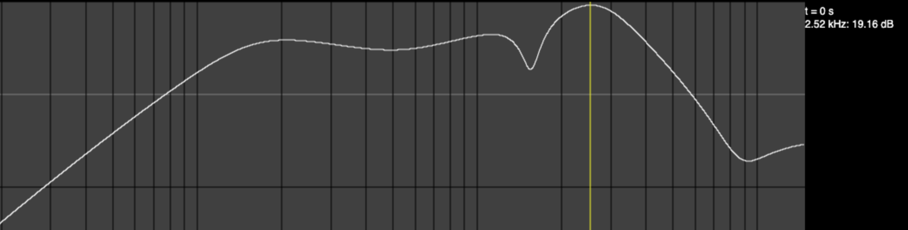
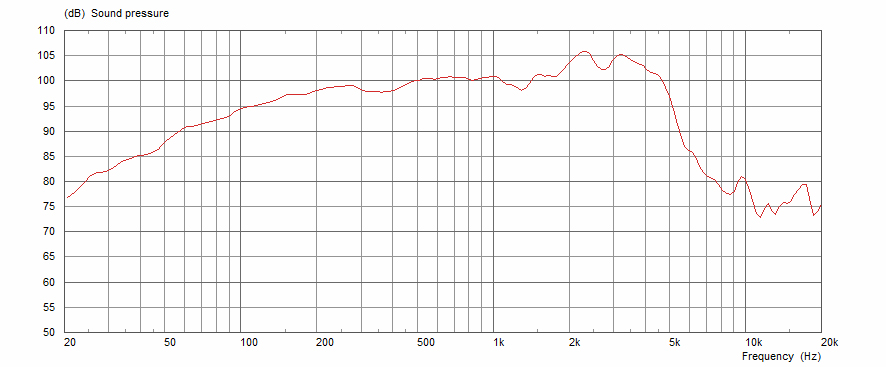
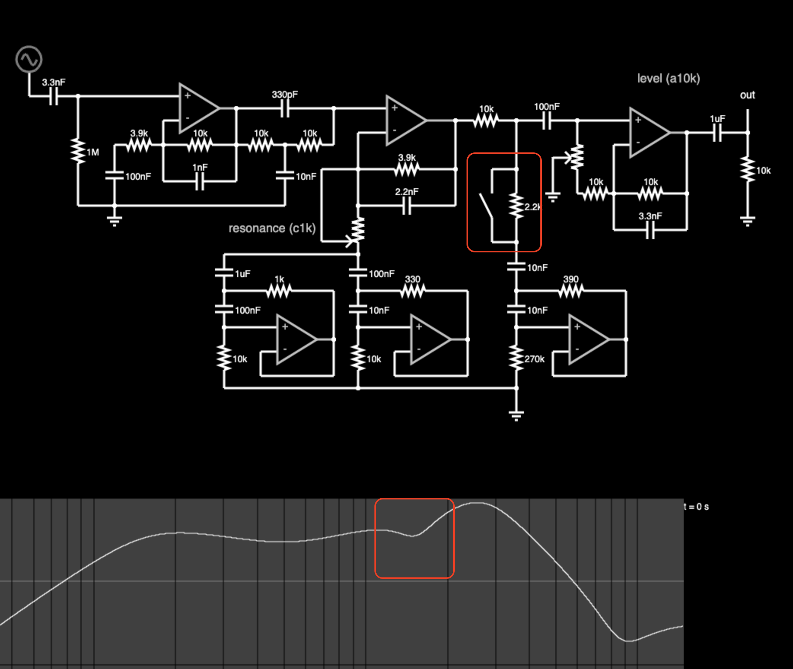
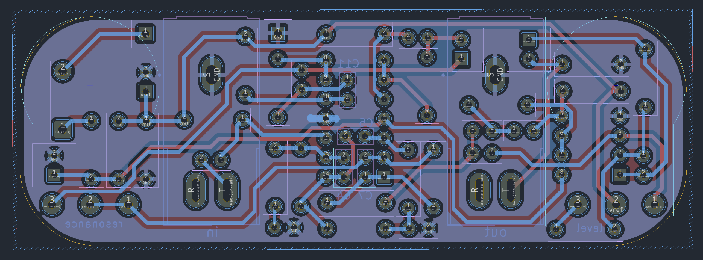
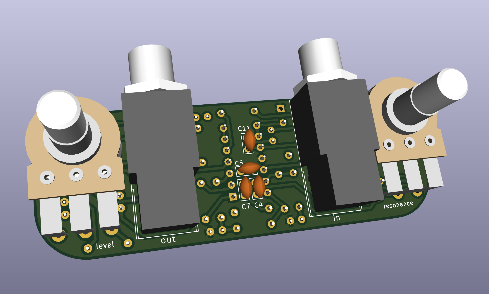

* Cabinet Simulator
This circuit provides a kind of specialized equalization designed to mimic the unique frequency response of a guitar speaker cabinet. Far from a flat or full-range response that you would expect from a Hi-Fi or home theater loudspeaker, a guitar cabinet has a lumpy response of peaks and dips. However, this response is what people expect to hear from a guitar, and it occupies a specific space in the context of a full mix of other instruments.

The response curve of a miked guitar cabinet is a product of the loudspeaker itself, the cabinet size and shape, and the microphone and its placement. This simple analog cabinet simulator does not attempt to replicate every variable, but instead give a reasonable approximation using a minimum number of parts.

** The Circuit
#+caption: schematic

[[https://www.falstad.com/afilter/circuitjs.html?cct=$+0+0.000005+5+55+5+50%0A%25+0+14728.71298666107%0AO+1088+224+1088+176+0%0A170+144+176+144+128+3+20+1000+5+0.1%0Ac+144+176+208+176+0+3.3e-9+0%0Ar+208+176+208+320+0+1000000%0Ar+416+240+480+240+0+10000%0Ar+480+240+544+240+0+10000%0Ac+480+240+480+320+0+1e-8+0%0Ac+416+192+544+192+0+3.3e-10+0%0Aw+544+192+544+240+0%0Ag+256+320+256+336+0%0Aw+576+224+576+272+0%0Ac+576+384+576+432+0+1e-7+0%0Ac+576+432+576+480+0+1e-8+0%0Ar+576+432+720+432+0+330%0Aa+624+496+720+496+1+15+-15+1000000%0Aw+720+432+720+496+0%0Aw+576+480+624+480+0%0Ar+576+480+576+560+0+10000%0Aw+624+512+624+544+0%0Aw+624+544+720+544+0%0Aw+720+544+720+496+0%0Aw+704+272+704+320+0%0Ac+704+320+576+320+0+3.3e-9+0%0Aa+448+496+544+496+1+15+-15+1000000%0Ar+400+480+400+560+0+10000%0Ac+400+480+400+432+0+1e-7+0%0Ac+400+432+400+384+0+0.000001+0%0Ar+544+432+400+432+0+1000%0Aw+544+432+544+496+0%0Aw+448+512+448+544+0%0Aw+544+544+448+544+0%0Aw+544+496+544+544+0%0A174+576+320+528+384+0+1000+0.9950000000000001+res%0Aw+528+272+576+272+0%0Aw+400+560+576+560+0%0Aw+576+320+576+272+0%0Aa+832+496+928+496+1+15+-15+1000000%0Ac+784+480+784+432+0+1e-8+0%0Aw+832+512+832+544+0%0Aw+928+544+832+544+0%0Aw+928+544+928+496+0%0Ar+784+480+784+560+0+330000%0Aw+832+480+784+480+0%0Aw+928+496+928+432+0%0Ar+928+432+784+432+0+330%0Ac+784+368+784+432+0+1e-8+0%0Aa+320+192+416+192+1+15+-15+1000000%0Aw+320+208+320+240+0%0Aw+416+240+416+192+0%0Aw+208+176+320+176+0%0Aw+528+352+528+272+0%0Ag+784+560+784+592+0%0Aw+576+384+400+384+0%0Aw+400+480+448+480+0%0Ar+320+240+416+240+0+10000%0Aw+320+240+320+288+0%0Ac+320+288+416+288+0+3.3e-9+0%0Aw+416+288+416+240+0%0Ac+256+320+256+240+0+1e-7+0%0Ar+320+240+256+240+0+3300%0Aw+704+272+704+208+0%0Aa+576+208+704+208+1+15+-15+1000000%0Aw+544+192+576+192+0%0Ar+704+208+784+208+0+10000%0Aa+912+224+1008+224+1+15+-15+1000000%0Aw+912+208+864+208+0%0Aw+912+240+912+304+0%0Aw+1008+304+1008+224+0%0Aw+256+320+480+320+0%0Aw+208+320+256+320+0%0Ar+704+272+576+272+0+3300%0Aw+576+560+784+560+0%0A174+864+208+832+304+0+10000+0.9851000000000001+level%0Ag+832+256+832+304+0%0Ar+864+304+912+304+0+10000%0Ar+912+304+1008+304+0+10000%0Aw+912+304+912+352+0%0Ac+912+352+1008+352+0+3.3e-9+0%0Aw+1008+352+1008+304+0%0Ax+406+355+520+358+0+16+resonance+(c1k)%0Ax+943+158+1025+161+0+16+level+(a10k)%0Ac+1008+224+1088+224+0+0.000001+0%0Ar+1088+224+1088+320+0+10000%0Ag+1088+320+1088+336+0%0Ac+784+208+864+208+0+1e-7+0%0Ar+784+272+784+368+0+2200%0Aw+784+368+752+368+0%0As+752+368+752+272+0+0+false%0Aw+784+272+752+272+0%0Aw+784+272+784+208+0%0Ao+1+16+0+34+5+0.00009765625+0+-1+in%0Ao+0+16+0+34+2.5+0.00009765625+1+-1+out%0A][simulation]]

Starting with a high input impedance (~1MΩ) suitable for a passive electric guitar pickup, the input stage starts with a gain of about 3.5x that falls off with a first-order highpass response below about 750Hz.

After the input gain stage is a bridged-T notch filter at around 9kHz. The notch isn't the goal, rather the 2nd-order sloping lowpass filter from 2kHz-9kHz. This is a steep roll-off which would normally be achieved with a 2nd- or 3rd-order active filter. But later parts of the circuit will further attenuate the highs above 9kHz so this trick achieves most of the response with fewer components.

Following the notch is an active gyrator stage. Two resonant impedance converters (gyrators) tuned to 150Hz and 2.8kHz respectively create two broad peaks. A "resonance" control allows the user to dampen or increase the contribution of these two peaks to the overall signal.

Next comes another active gyrator, but this one acts as a notch rather than a peak, sharply cutting high midrange at around 1.5kHz. This notch aims to simulate the comb filtering of the speaker cone that a close microphone picks up.

Finally an output gain stage provides an active "level" control to adjust volume, providing up to 22dB of overall gain at 2.5kHz.

For the circuit tweaking enthusiasts out there, here is an illustration of which parts of the circuit are responsible for which parts of the frequency response:

#+caption: illustrated frequency response

** Component Values
One of my design goals is to use as few different comoponent values as possible without sacrificing functionality. This makes it easier to buy components in bulk if you only need to have a small handful of different values. In this circuit, you might notice there are a lot of 10kΩ resistors and 10nF and 100nF capacitors. But it's not always feasible to just use values where the most significant digit is =1=. So there are also some 3.9kΩ resistors and 330pF and 3.3nF capacitors. My working theory is that the optimal balance between expressivity and using the minimum number of different values is to have a set of values that are multiples of =1=, and =3.3=. I fell short of that goal in this circuit by including 2.2nF and 3.9kΩ values, but the vast majority of values are multiples of =1=, so that gives me some warm fuzzy feelings.

** Frequency Response
The frequency response of this circuit touches on the key aspects of a typical guitar speaker and speaker cabinet: first order highpass around 200Hz, 2nd order lowpass around 5kHz, and a slight notch between 1kHz and 2kHz.

#+caption: resonance = 0

#+caption: resonance = 0.5

#+caption: resonance = 1

For comparison, Celestion [[https://celestion.com/product/vintage-30/][publishes]] a frequency response plot of their Vintage 30 loudspeaker that looks like this:

#+caption: vintage 30

** Possible Modifications
As shown, this circuit is stripped-down to the essentials. But there are some minor mods you can do to make it more flexible.

#+caption: de-notch

For example, partially disabling the 2.5kHz notch will change the character noticeably and only costs one switch and one resistor.

** 1590a Layout
This repo contains KiCad files for a circuit board layout intended to fit inside a 1590a-sized enclosure.

Circuit board layers:

3D Render:

* Why Cabsim?
Here are a couple reasons to use a cabinet simulator:
1. You are going "ampless" and relying on PA monitors instead of guitar amplifiers. This eliminates some of the heaviest and most cumbersome gear a guitarist deals with, and keeps stage volumes more manageable.
2. You're recording with an audio interface but want to monitor your raw track, and the direct headphone out of the interface sounds bad. A cabsim can make it sound closer to how a guitar cabinet should sound, which will sound more natural in your headphones and hopefully make recording a more pleasant process.
3. You want a headphone setup for silent practice, but the raw signal coming out of your pedals is much too harsh. This cabsim will roll off the highs and give a bit of character so it sounds less flat and sterile.
   
* What Alternatives Exist?
A cabinet simulator is really just a kind of EQ, so naturally if you have an EQ pedal already, you can use it to do the job of a cabinet simulator.
